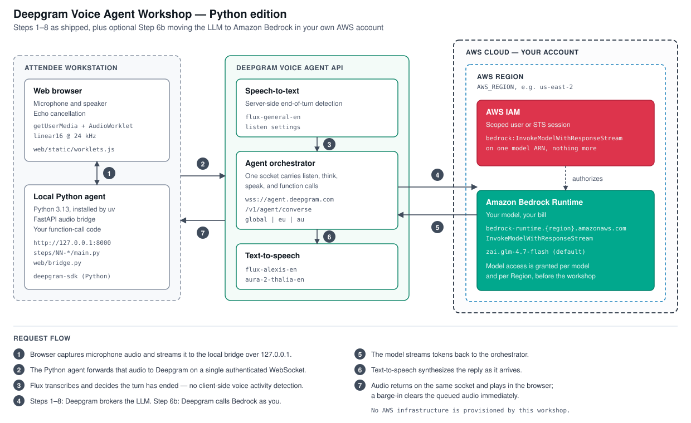
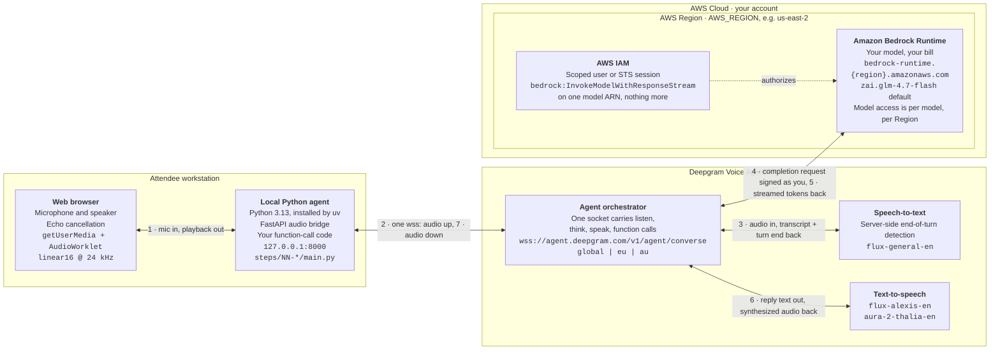

# Deepgram Voice Agent Workshop: Python Edition

Build a real-time voice agent in Python, one runnable step at a time. You speak, it listens on Flux, thinks with an LLM, answers in a natural voice, stops when you interrupt it, and calls your code when it needs something it can't know.

Every step is a complete, working program. The agent is entirely Python. The browser is only the microphone and the speaker. Optional Step 6b moves the agent's brain onto Amazon Bedrock in your own AWS account.

---

## Target audience

**Built for developers who want a voice agent working today, not a survey of the field.**

| | |
|---|---|
| **Primary audience** | Application developers, solutions architects, and technical leads evaluating real-time voice for a product |
| **Secondary audience** | Sales engineers and developer advocates who need a demo they can explain line by line |
| **Assumed skill** | Comfortable reading and editing Python. That's the bar. |
| **Not assumed** | Audio engineering, DSP, speech recognition, or machine learning background. Nothing here asks you to know what a mel spectrogram is. |
| **AWS knowledge** | None for Steps 1-8. Step 6b assumes you can create an IAM user and find the Bedrock console. |
| **Group size** | One person self-paced, or a room. One instructor plus one floating helper per ~15 attendees. |

**Who should take a different path.** If you aren't a developer, or you're on a locked-down laptop, Chromebook, or tablet, [README_EASY_MODE.md](README_EASY_MODE.md) runs the same workshop entirely in the browser through the [Deepgram Playground](https://playground.deepgram.com/voice-agent), with no install and no terminal. Its labs map one to one onto the steps, so a mixed room stays in sync.

## Estimated deployment time

Nothing is deployed to a server, so "deployment" here means getting to a working agent on your own machine.

| Phase | Time | What happens |
|---|---|---|
| **Prerequisites** | ~10 min | Install [uv](https://docs.astral.sh/uv/getting-started/installation/), sign up for a [Deepgram key](https://console.deepgram.com/signup?jump=keys) |
| **Setup** | ~5 min | `uv sync`, copy `.env.example` to `.env`, paste your key |
| **First verified run** | ~15 min | Step 1 checks your key, browser, microphone, and output |
| **Core path (Steps 0-5)** | ~90 min | Ends with a working voice agent you can interrupt mid-sentence |
| **Full path (Steps 0-8)** | ~3 hours | Adds persona, function calling, and latency tuning |
| **Optional Step 6b (Bedrock)** | ~15 min | The step itself. Getting AWS access is the slow part, covered below. |

**One dependency to install.** uv fetches Python 3.13 and every package itself, so you don't need Python already. One virtual environment serves every step; you run `uv sync` once.

**Skip the local install entirely.** [.devcontainer/README.md](.devcontainer/README.md) runs the whole workshop in a container. GitHub Codespaces needs nothing local; VS Code Dev Containers needs only Docker. Both arrive with `uv sync` already run and `.env` already created, so setup collapses to pasting your key.

**Plan around Bedrock model access, not around Step 6b.** The step takes 15 minutes. Bedrock grants model access *per model* and *per Region*, and some model families additionally require a one-time use case form that is not instant. If you want Step 6b, request access days ahead, a week if you're running this for a room. Everything else in the workshop needs only a Deepgram key.

## Pricing and billing notes

**Steps 1-8: one credential, one bill.** Your Deepgram API key pays for speech-to-text, the LLM, and text-to-speech alike. Deepgram brokers the LLM call, so there is no OpenAI account, no second key, and no second bill.

| Item | Who bills you | Expected cost |
|---|---|---|
| Deepgram speech-to-text, LLM, text-to-speech | Deepgram | Well under $1 per attendee for a full 3-hour run |
| New Deepgram account credit | Nobody | $200 free on signup, which covers this workshop with room to spare |
| Amazon Bedrock tokens (Step 6b only) | AWS, in your account | Cents for a workshop-length conversation |
| AWS infrastructure | Nobody | None. This workshop provisions no AWS resources. |

**Nothing here runs when you aren't running it.** Everything is either a local process you started or a metered API call. No always-on infrastructure sits waiting to be forgotten, and nothing accrues cost between sessions.

**Step 6b is where a second bill appears.** Deepgram brokers OpenAI, Anthropic, Google, and NVIDIA: it holds the account, makes the call, and bills you. Groq and AWS Bedrock work the other way: Deepgram makes the call *as you*, with credentials you hand it, against an endpoint you name. Your account, your model access, your bill. After Step 6b, the request shows up in **AWS → Bedrock → Usage** and nowhere in your Deepgram console. Speech-to-text and text-to-speech are still Deepgram's; only the middle of the pipeline changed hands.

**The default Bedrock model is chosen for cost and latency.** `zai.glm-4.7-flash` is fast and cheap, which matters more than raw capability when someone is waiting to hear a reply. Swap it with `AWS_BEDROCK_MODEL` if you want to hear what a different brain does to latency, and check current rates on the [Amazon Bedrock pricing page](https://aws.amazon.com/bedrock/pricing/) before you pick something large.

**Teardown.** Delete the IAM access key you created for Step 6b when you're done. It is the only credential this workshop asks you to create in your own cloud, and it has no reason to outlive the day.

## Architecture

The agent runs on the attendee's machine. Deepgram handles the real-time speech path over a single WebSocket. In optional Step 6b, the LLM moves into the attendee's own AWS account, reached through a narrowly scoped IAM principal.

Same diagram as Mermaid source

Paired arrows carry the round trip in both directions, which is what keeps the graph readable. The numbered flow below walks it one hop at a time.

**Request flow**

1. The browser captures microphone audio and streams it to the local bridge over `127.0.0.1`. It has to be `127.0.0.1`, because browsers only grant microphone access on a secure context and a LAN address is not one.
2. The Python agent forwards that audio to Deepgram on a single authenticated WebSocket. One connection carries listen, think, speak, and function calls together.
3. Flux transcribes and decides the turn has ended. Turn detection is server-side, which is what removes voice activity detection from your client entirely.
4. The orchestrator calls the think provider. In Steps 1-8 that's a model Deepgram brokers. In Step 6b it's Bedrock, called as you, with the credentials you supplied in the `Settings` message.
5. The model streams tokens back to the orchestrator as they're generated.
6. Text-to-speech synthesizes the reply as it arrives rather than waiting for the full sentence.
7. Agent audio returns on the same socket and plays in the browser. A barge-in clears the queued audio immediately, the difference between a demo and something people will use.

### How this follows AWS architectural guidance

**Least privilege, sized to the task.** Step 6b asks for an IAM user or STS session scoped to `bedrock:InvokeModelWithResponseStream` on the one model ARN in use. Not admin keys, not `bedrock:*`. The blast radius of a workshop credential should be one model in one Region.

**Prefer short-lived credentials.** The step accepts STS credentials as readily as long-lived IAM keys: set the access key pair to the temporary values and add `AWS_SESSION_TOKEN`. Its presence is what switches the credentials type from `iam` to `sts`.

**Be explicit about where the credential travels.** Your access key and secret go into the `Settings` message, over the WebSocket, to Deepgram. That is what "Deepgram makes the call as you" means, and it's the reason the scoping above isn't optional advice. The workshop says so in plain terms rather than burying it.

**One Region, named once.** `AWS_REGION` sets both the credentials' Region and the Bedrock endpoint URL, which have to agree. No step hardcodes a Region, so there's a single place to change and nothing to get out of sync.

**Data residency is a configuration choice, not a rewrite.** `DEEPGRAM_REGION` points the speech path at the global, EU, or Australia endpoint, and the same mechanism points the workshop at a Deepgram Dedicated or self-hosted deployment. On AWS, that self-hosted form is Amazon SageMaker. Pair an EU speech endpoint with an EU Bedrock Region when that's what the audit requires. One line moves every step together. See [web/region.py](web/region.py).

**Graceful degradation.** Step 6b's `think_settings()` guards on the presence of AWS credentials and falls back to the brokered provider without them. The person next to you whose model access never got approved can still run your file, and Step 7 continues from Step 6 either way.

**No infrastructure to leave running.** The workshop provisions nothing in your account. The only artifact to clean up is the IAM credential you created.

> **Deepgram's speech models also run in your account, on SageMaker.** Step 6b puts the LLM in your account. The speech models can go there too: Flux, Nova-3, and Aura-2 are on AWS Marketplace and [deploy to Amazon SageMaker endpoints](https://developers.deepgram.com/docs/deploy-amazon-sagemaker) in your own VPC, which is the answer when audio can't leave your network at all. That's a different architecture from this workshop, not a setting in it — SageMaker's network isolation blocks the outbound LLM calls the orchestrator makes, so the Voice Agent API doesn't run there. No step here uses SageMaker; it's noted so you know the path exists.

## Getting help

- [Deepgram Voice Agent docs](https://developers.deepgram.com/docs/voice-agent)
- [Flux docs](https://developers.deepgram.com/docs/flux)
- [GitHub Discussions](https://github.com/orgs/deepgram/discussions)
- [Discord](https://discord.gg/xWRaCDBtW4)
